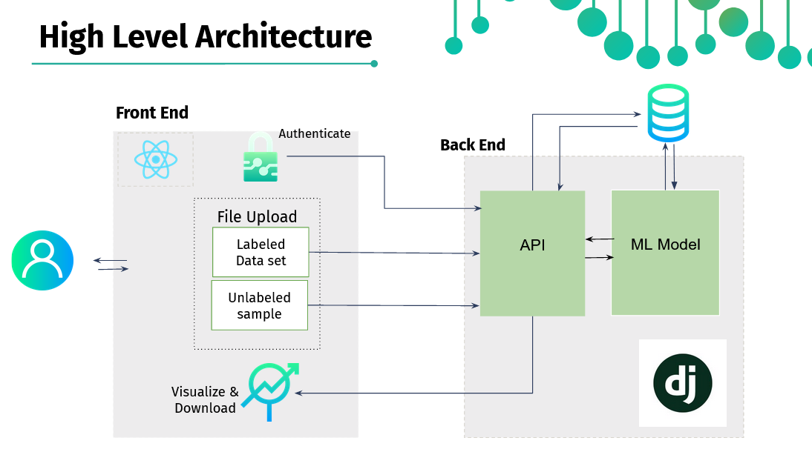
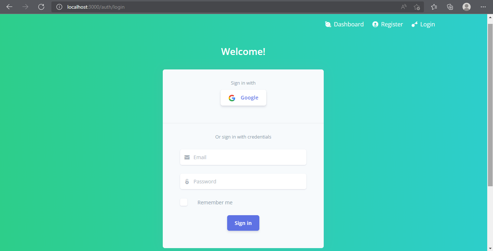
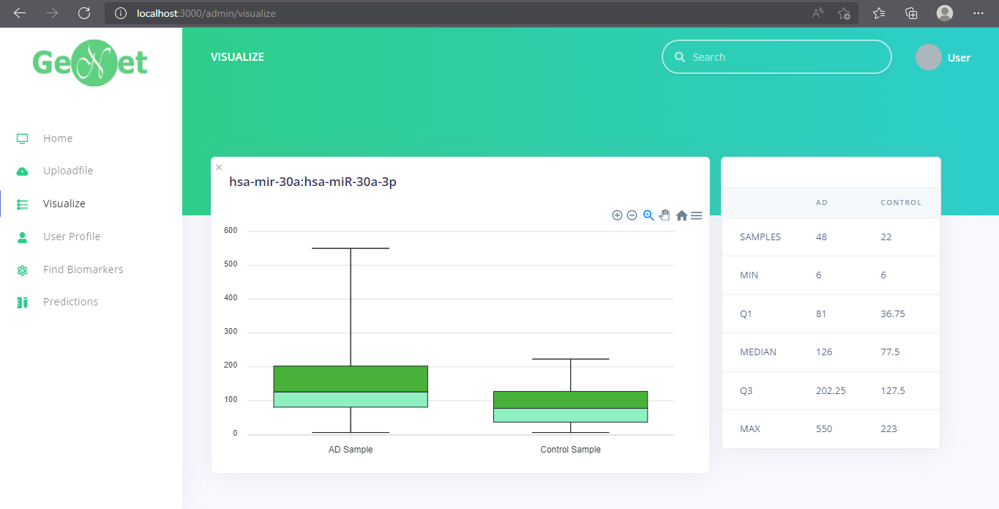
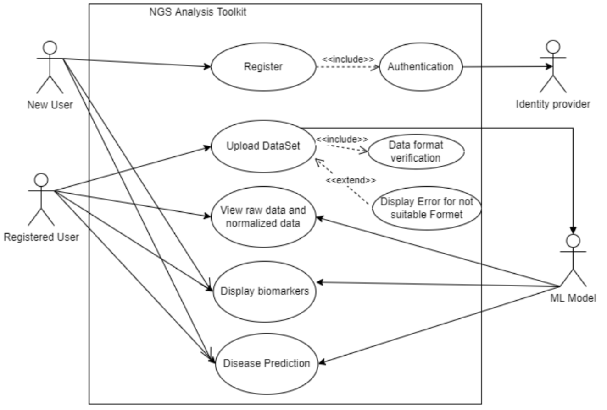

## Team
-  E/17/015, ARSHAD MRM  , [e17015@eng.pdn.ac.lk](mailto:e17015@eng.pdn.ac.lk)
-  E/17/327, KAVINAYA Y, [e17159@eng.pdn.ac.lk](mailto:name@email.com)
-  E/17/379, NISHANKAR S, [e17230@eng.pdn.ac.lk](mailto:name@email.com)

## Table of Contents

  1. [Introduction](#1.introduction)
  2. [Problem Overview](#2.problem-overview)
  3. [Solution Overview](#3.solution-overview)
  4. [Solution Architecture](#4.solution-architecture)
  5. [Data Flow](#5.data-flow)
  6. [Requirements Analysis](#6.requirements-analysis)
  7. [Use Case Diagrams](#8.use-case-diagrams)
  8. [Machine Learning Proposal](#9.machine-learning-proposal)
  9. [Machine Learning Workflow](#10.machine-learning-workflow)
   - [Team](#team)
   - [Links](#links)

---

## Introduction

This is a Online toolkit to detect the biomarkers for Alzheimer’s Disease using the Next generation Sequencing Data Set. Simple and self explanatory GUI elements of our toolkit will help to analyse the data and visualize them in different ways (different graps and tables).

## Problem Overview

### Problem related to Alzheimer's Disease

-   Found in people aged 65 or above
-   Still has no efficient cure
-   Sixth most leading death cause in world.
-   Spreads in human body before 20 years when the symptoms are shown
-   Can be found at early stage

### Problem related to detecting biomarkers

- High cost and time 
- Lack of online tools
- People without programming knowledge tends to have difficulties when using existing tools

## 3.Solution Overview

Better biomarker could provide an early sign before symptoms start to show, enabling more effective prevention treatment.
So, we are proposing a online tool which can be detect the biomarkers for Alzheimer's disease using the Ngs data set of Diseased samples and Control samples.

## 4.Solution Architecture

## 5.Data Flow

## UI & UX

## 6.Requirements Analysis

### 6.1.Functional Requirements

#### Users 
- Login and sign up
- View the results of provided data sample 

#### Registered users 
- Browse a table of provided data or upload their own files
- Manage their files and data
- Search bar 
- Able to visualize the data using different methods (Box plot, Scatter plot, heatmap, ROC)
- Able to normalize the data
- Able to use different feature selection methods
- Make future predictions
- The output and results should be downloadable

### 6.2.Non-Functional Requirements

#### Scalability
- System should be utilized.
- Scalability of the system should be high in order to handle a huge amount of data.

#### Usability
- Take minimal time to detect biomarkers
- User’s data need to be recoverable.
- Good data processing pipeline
- No need for programming skills

#### Availability
- System should be available for 24/7.
- Able to access across the globe.

## 7.Use case Diagrams

## 8.Machine Learning Proposal

## 9.MACHINE LEARNING WORKFLOW

## Links
<!-- - [Project Page](https://cepdnaclk.github.io/e17-3yp) -->
- [Project Repository](https://github.com/cepdnaclk/e17-co328-NGS-Data-AnalysingToolkit)
- [Project Page](https://cepdnaclk.github.io/e17-co328-NGS-Data-AnalysingToolkit/)
- [Department of Computer Engineering](http://www.ce.pdn.ac.lk/)
- [University of Peradeniya](https://eng.pdn.ac.lk/)

[//]: # (Please refer this to learn more about Markdown syntax)
[//]: # (https://github.com/adam-p/markdown-here/wiki/Markdown-Cheatsheet)
